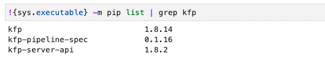

# kf-examples
this repository contains examples of kubeflow pipeline for the talks at:
* [GDG Cloud Munich October Gathering on 5 Oct. 2022](https://gdg.community.dev/events/details/google-gdg-cloud-munich-presents-october-gathering-1/)

# Notebooks
* exploring-iris-data-notebook: explores the iris dataset used later in the pipelines
* single-model-pipeline-example: demonstrates a pipeline trains a single ANN model with tensorflow and shows the performance metrics and confusion matrix visualization for the test dataset.
* multiple-models-pipeline-example: demonstrates a pipeline trains an ANN model with tensorflow, a SVM model with scikit-learn and shows the performance metrics and confusion matrix visualization for both trained models performing on the test dataset.
* patch-notebook-env-kfp-run: helps to setup the right environment while running a kfp pipeline with kfp python sdk from notebook the first time.

# Issue
Should you encounter a 500 server issue while runing the demo pipelines with kfp python sdk for the first time from the Kubeflow notebook server.

Please double check whether the `kfp-server-api 1.6.2` is outdated.

* For KF 1.4.1, `kfp-server-api 1.7.1` are necessary.
* For KF 1.5.1, `kfp-server-api 1.8.2` are necessary.

The major version number to the kfp-server backend shall match, so that a pipeline can be started.
