# Create Kubeflow Pipeline from Workbench

A Kubeflow pipeline is a **portable** and **scalable** definition of a machine learning (ML) workflow. Each step in your ML workflow, such as preparing data or training a model, is an instance of a pipeline component.

## 1. Create a Workbench with access to Kubeflow

A Kubeflow pipeline can be created with [Kubeflow Python SDK](https://pypi.org/project/kfp/) using its own DSL (domain specific language). Currently, the Kubeflow Pipeline SDK (kfp) is only available in Python programming language.

### Add `Allow access to Kubeflow Pipelines` PodDefault
Let's create a Jupyter Notebook first to interact with the Kubeflow Pipeline API Server backend.

1. Navigate to "Kubeflow UI Dashboard" -> "Notebooks" -> "+ New Notebook"

2. Input the following values in the `New notebook` plane

| Basic Category | Input |
|:--- | :--- |
| Name: | pipeline-test |
| Type: | JupyterLab |
| Custom Notebook: | kubeflownotebookswg/jupyter-scipy:v1.7.0 |
| CPU: | 0,2 |
| RAM in GiB: | 0,5 |

| Workspace Volume | Input |
|:--- | :--- |
| New volume | |
| Type | Empty volume |
| Size in Gi | 5 |
| Storage class | homedir |
| Access mode | ReadWriteOnce |
| Mount path | /home/jovyan |

3. Open the Advanced Options


and select the Configurations
* Allow access to Kubeflow Pipelines

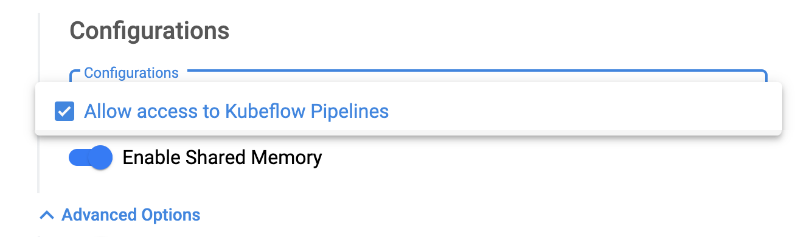

4. Click on `LAUNCH` button to create a new jupyterlab workbench.


Notice:
* If you haven't created `Allow access to Kubeflow Pipelines` PodDefault in your namespace, please follow the instruction in Section [Git Versioning and Env variable](./workbench4.md) to create `Allow access to Kubeflow Pipelines` PodDefault first, and then back to this tutorial section.

## 2. Create first kubeflow pipeline

Let's `CONNECT` to the created JupyterLab workbench `pipeline-test` with the kubeflow access token mounted.

You can create a Python Jupyter Notebook from the `Launcher` by click on the Notebook `Python 3`.

In this tutorial, you will start with a provided `notebook` to start your first pipeline.

1. Fetch the workshop git code repository by typing the following in terminal in the `pipeline-test` JupyterLab workbench:
```shell
cd $HOME;
git clone https://github.com/yingding/kf-examples;
```

2. Navigate the `kf-examples/sdkV1/toy_v1_add.ipynb` in JupyterLab file browser, open it by double click.

Click on the ">>" Button to "Restart Kernal and Run All cells ..." 

Or you can run every cell single separately and see examing the python notebook

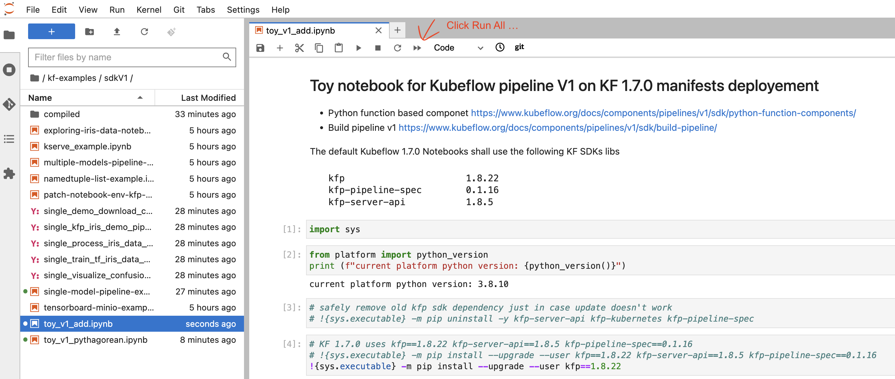

3. You can see, "Experiment details" and "Run details" as output at the end of `toy_v1_add.ipynb`, click on it to open the `Run details`

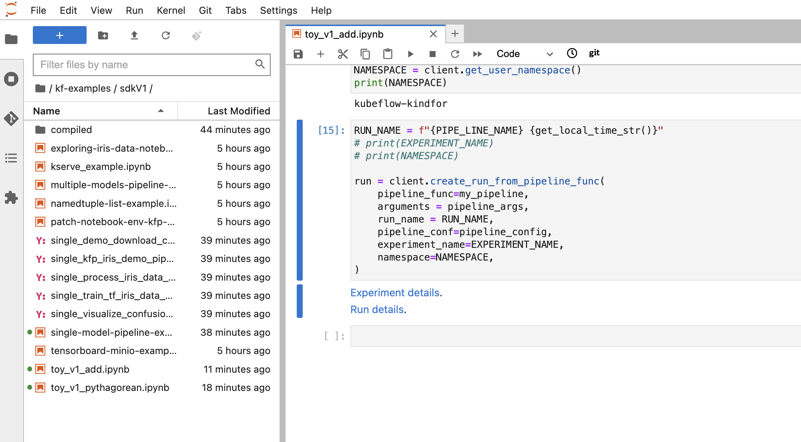


4. Click on `Add op` component in the pipeline graph view to open the side panel

You can see `Input/Output`, `Details`, `Logs` ... of the Pod in this first pipeline run.

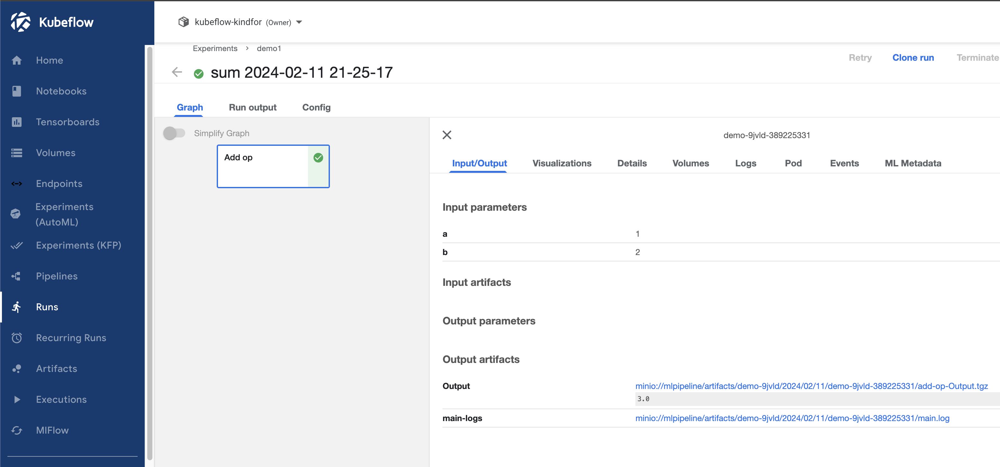

Note:
* You can also access the `Run` info of kubeflow pipeline from `Kubeflow Dashboard UI` -> `Runs`

## 3. Upload your first pipeline 

Let's go back to the jupyter workbench by switch back the opened tab in browser.

1. Navigate to `kf-examples/sdkV1/compiled/` folder, you can see the file `sum.yaml` which is a Yaml representation of your first KFP pipeline.

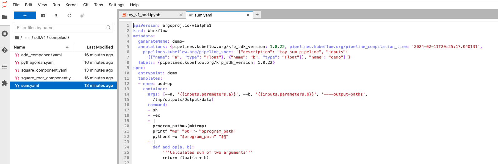

2. You can download `sum.yaml` by right mous click on the file in Jupyter file browser, and click on `Dowload` and save it in a location of your choice.

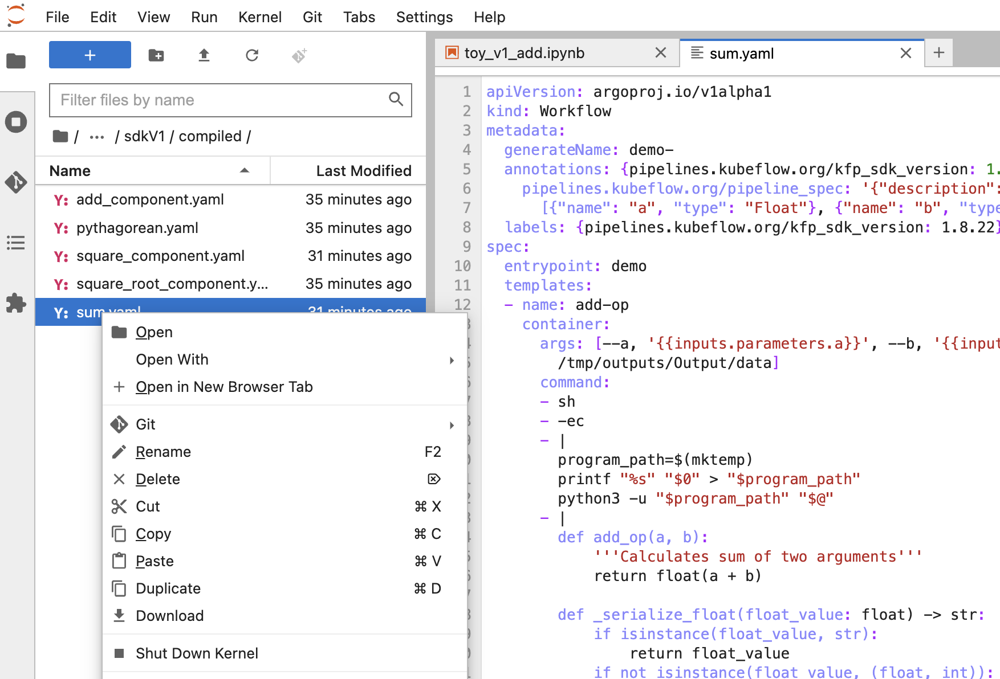

3. Navigate to `Kubeflow Dashboard UI`, goto `Pipelines` view, and click on "+ Upload pipeline" on up right corner 

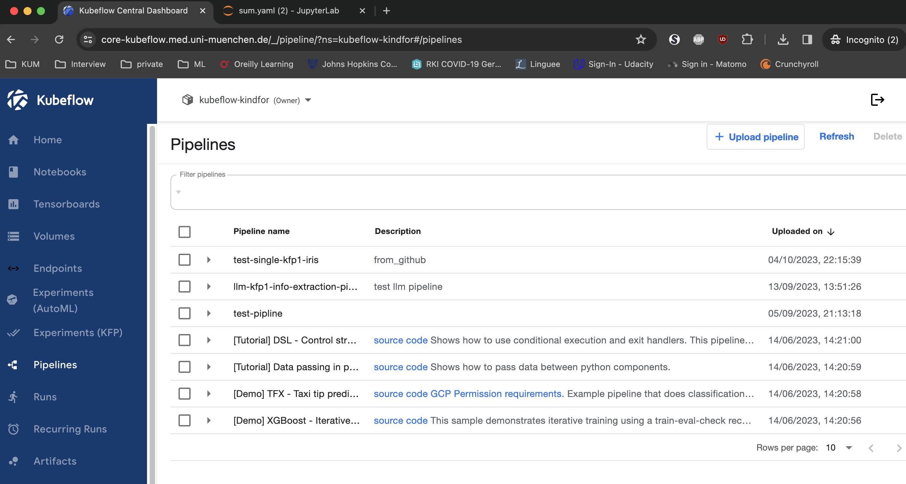

4. Input the following values in the "Upload Pipeline or Pipeline Version" plane

| Creat a new pipeline | |
|:--- | :--- |
|Pipeline Name: | sum-numbers-pipeline |
|Pipeline Description: | this pipeline sums two float inputs|
|Upload a file: | < choose your sum.yaml file download previously > |

Click on `Create`.

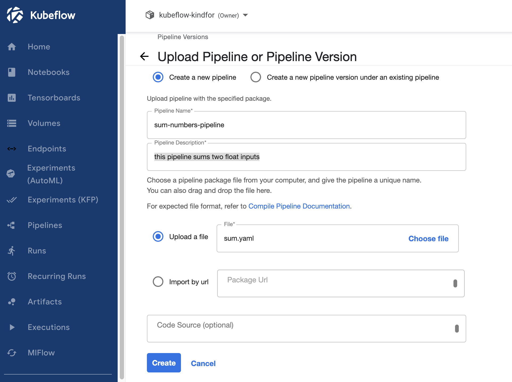

5. On the opened `sum-numbers-pipeline` plane, click on `Create run`

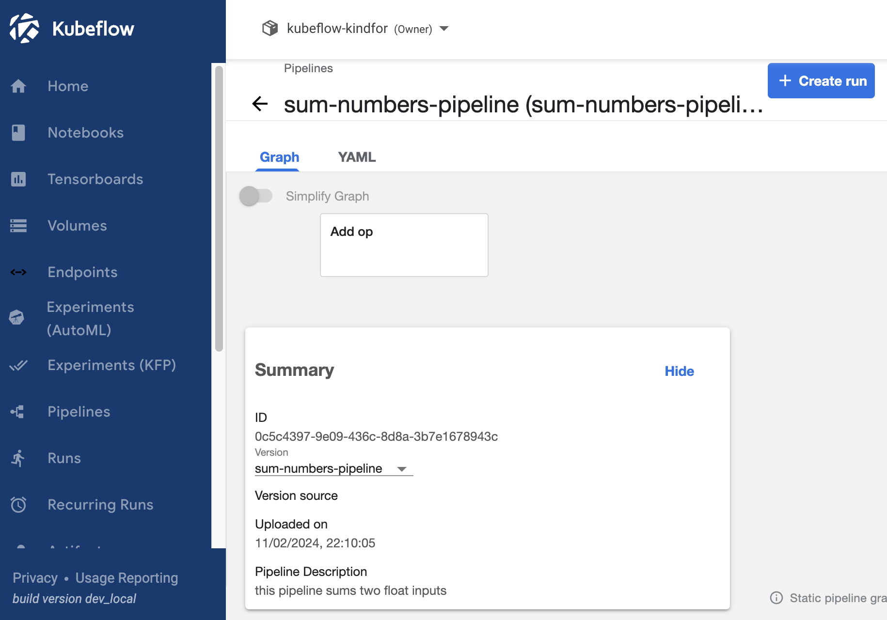

6. On the `Start a run` plane

* choose `Experiment` as "demo"
* Run parameters `a` to "3" and b "4"

keep the rest default inputs

Click on "Start"

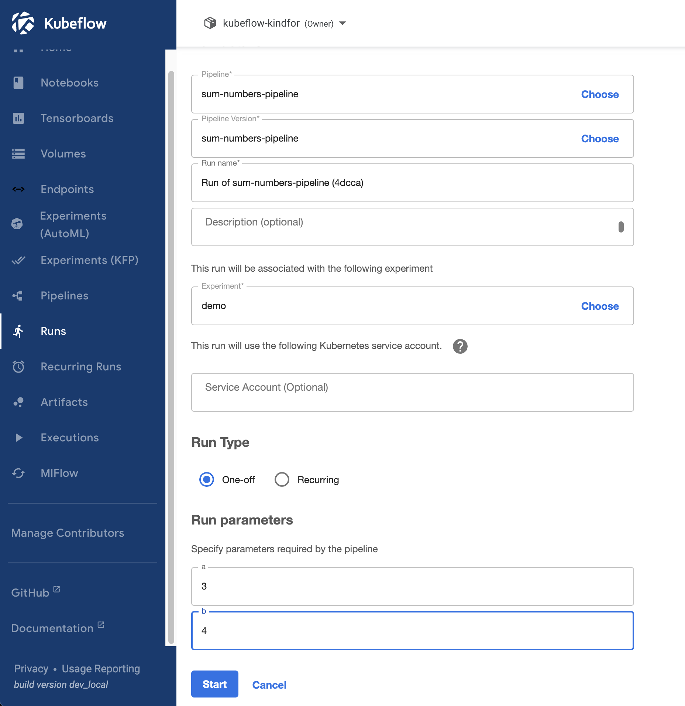

7. Examin the `Run` of your started pipeline `sum-numbers-pipeline`

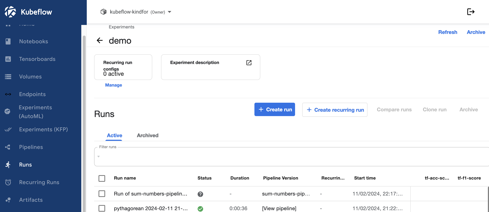


8. Click on the `top` run, you can following up the run info in the pipeline UI run view and see the logs of components in this pipeline run.

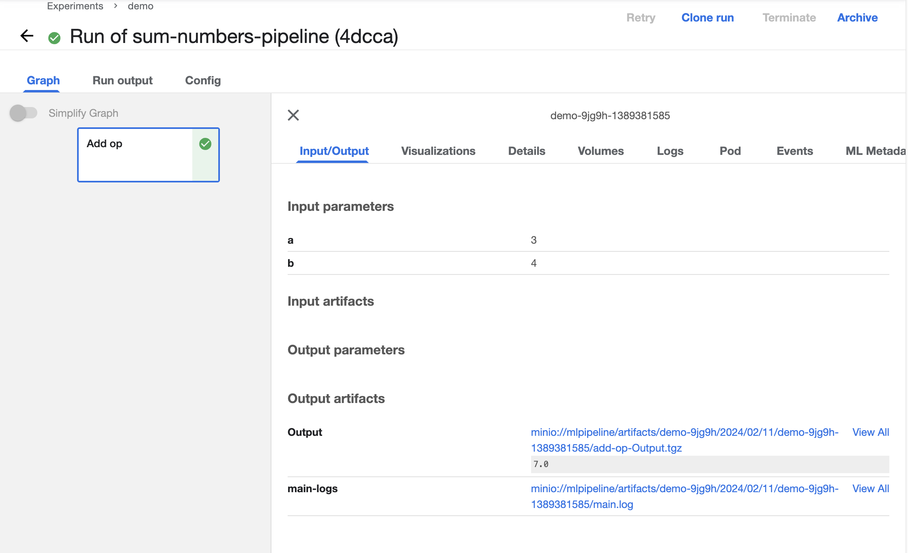


## 4. Summary

You have learned in this tutorial
* Create a Jupyter Workbench with Pipeline Access
* Start your first Kubeflow Pipeline using KFP python SDK from a Jupyter Notebook
* Examing the Run details of a Kubeflow Pipeline run
* Download the Yaml representation of Kubeflow Pipeline created by Python SDK
* Upload the Yaml representation of Kubeflow Pipeline via Pipelines UI
* Create a new run from the Kubeflow Pipeline with input params
* Exam the Run details from Experiments (KFP), Kubeflow Dashboard UI menu


 

