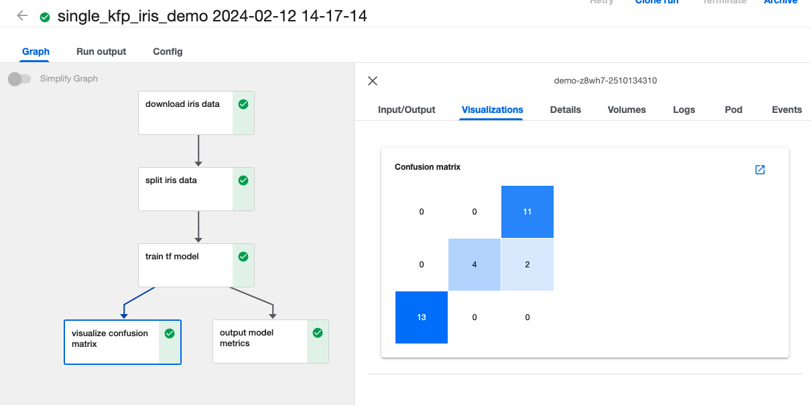
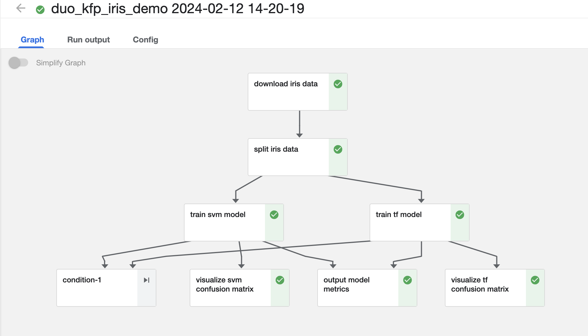
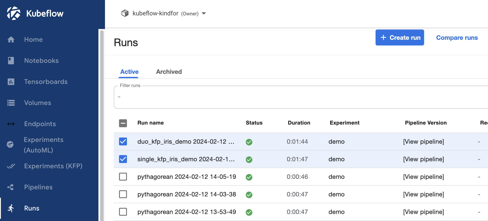
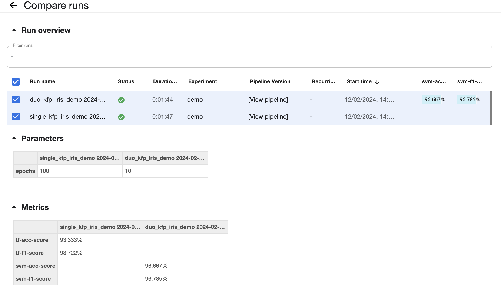

# Running further examples of Kubeflow Pipeline

This is an optional tutorial, please follow the instructions on your own pace at home.

## 1. Single TensorFlow Model Training Kubeflow Pipeline DAG example 

Please execute the `kf-examples/sdkV1/single-model-pipeline-example.ipynb` in your JupyterLab workbench and following this python notebook example on your own pace to study.

## 2. Mutiple ML Models Training Kubeflow Pipeline DAG example 

Please execute the `kf-examples/sdkV1/multiple-models-pipeline-example.ipynb` in your JupyterLab workbench and following this python notebook example on your own pace to study.

## 3. Compare ML pipeline runs

To compare the results of multiple runs in the past in Kubeflow:

1. Navigate to `Kubeflow Dashboard UI` -> Runs
2. Select the top two `Run` : "duo_kfp..." and "single_kfp..."
3. Click the "Compare runs" text button on the right top corner

You will see the `Compare runs` plane showing, you can examin hwo different hyper parameters and input variables can inference the ML pipeline output metrics such as "Accuracy" across multiple ML pipeline runs.

## 4. Summary

You have learned:
* Build kubeflow ML pipeline DAG with a single training tasks and pipeline UI visualization of confusion matrix
* Build kubeflow ML pipeline DAG with multiple single training task, pipeline UI visualization, conditional output metrics logging
* Compare and analyse multiple ML pipeline runs