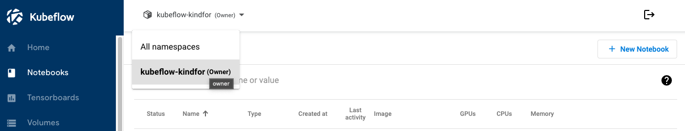
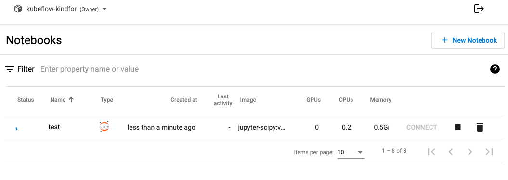
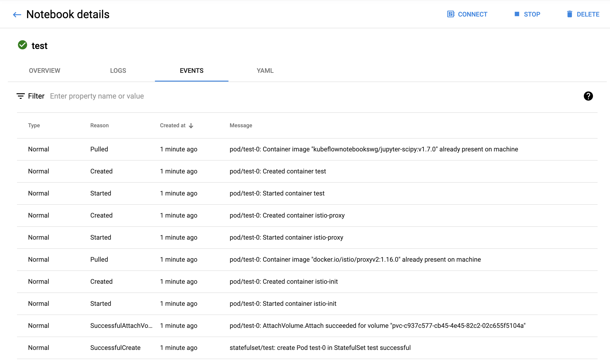
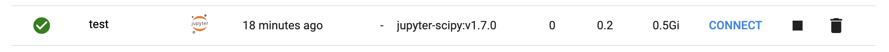

# Kubeflow Notebook/Workbench: Create, Monitor, Restart, Connect

## 1. Create a Kubeflow Jupyter Notebook

Notebooks -> "Choose a Namespace" -> 
"+ New Notebook"  to create a `Notebook/Workbench` in Kubeflow Web UI.

| Basic Category | Input |
|:--- | :--- |
| Name: | test |
| Type: | JupyterLab |
| Custom Notebook: | kubeflownotebookswg/jupyter-scipy:v1.7.0 |
| CPU: | 0,2 |
| RAM in GiB: | 0,5 |

| Workspace Volume | Input |
|:--- | :--- |
| New volume | |
| Type | Empty volume |
| Size in Gi | 5 |
| Storage class | homedir |
| Access mode | ReadWriteOnce |
| Mount path | /home/jovyan |

Note: 
* Do NOT change the mount path "/home/jovyan"

Click on "LAUNCH" to create a `Notebook Server / Workbench`

You will see a `Notebook/Workbench'` is created in your namespace, the status shows a wheel spinning.

## 2. Monitor the Workbench events, logs

It is possible to see the events during the creation of `Notebook/Workbench`.

1. Click on the name e.g. `test` of the workbench, to see the `details` of a workbench.

2. Click on the tab `EVENTS` to see the start events of your workbench

**Important:**
* `EVENTS` tab can contain valuable information to forward your `admin` team, should you encounter any issue to start a workbench

Please also visit `OVERVIEW`, `LOGS` tab to contain information to your workbench, and the logs details while working with your workbench.

## 3. Restart the Workbench

After the first creation of workbench, the workbench server will be started automatically.

You can stop the Workbench by click on the `stop` button at the end of the workbench.

To restart then click on the `start` button at teh end of the workbench.

Through `stop` and `start`, you can restart a workbench.

## 4. Connect the Workbench 

After the workbench is created (or restarted) successfully, you will see a check mark before the workbench.

Click on `CONNECT` at the end of workbench to connect with the workbench, you will see a new tab opens up.

**Important:**
* Sometimes you may not connect with workbench due to session and networking issues successfully

Workaround:
* If you still can not connect with workbench after 1 minute, close the `opened workbench tab` and click on `CONNECT` again