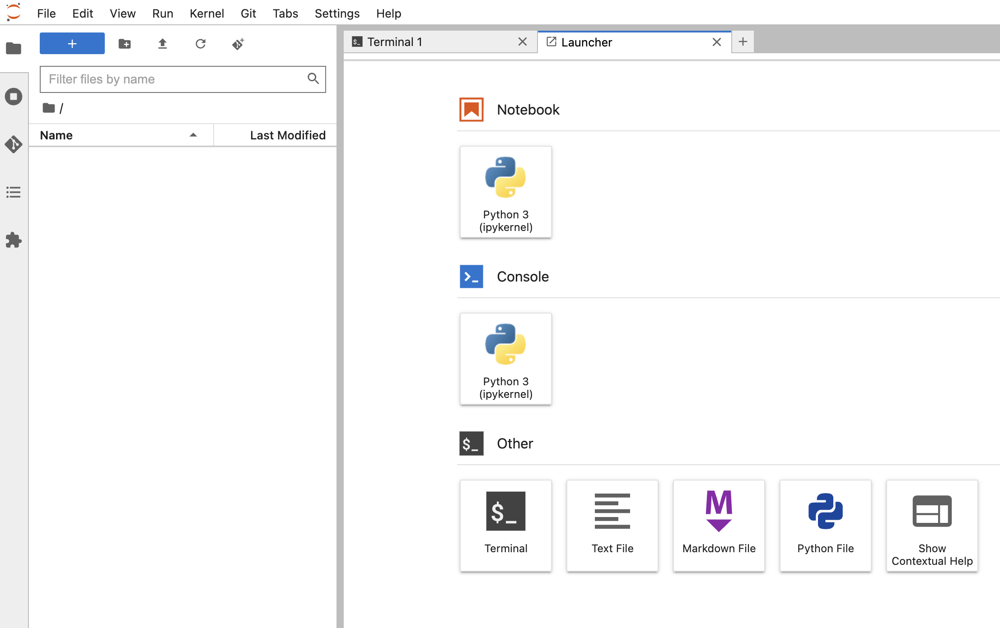

# Install, upgrade workbench python packages

## 1. Terminal basics
### Open Terminal

1. Click on the `+` Button to open `Laucher`
2. Click on the `Terminal` button on the `Laucher` plane
3. A new `terminal` tab will be open close to the `Laucher` tab
4. Click the `terminal` tab to interact with terminal




### Show Quotas
In the terminal type:
```shell
kubectl describe quota
```
to see the information regarding your quota in Kubeflow.

## 2. Upgrade Jupyterlab Version
1. Click on `Help` menu button
2. Click on `About JupyterLab` to see the current JupyterLab version


The current `juyterlab` version is `3.4.3` from the default Kubeflow Jupyternotebook Image.

Lets upgrade it to version `3.6.7`

In the opened terminal, you shall see the `base` conda env is activated. 
Lets type in:
```shell
# show python path
which python3;
# You shall see /opt/conda/bin/python3

# upgrade jupyterlab version
# we also need to upgrade the kfp package, due to some old dependency issues
python3 -m pip install --upgrade pip;
python3 -m pip install --user --upgrade jupyterlab==3.6.7 kfp==1.8.22;
```

Now close the `Workbench/Jupyter Notebook` Tab and restart the workbench server through `stop` and `start`


You can connect to the workbench again, by click on `CONNECT`


You can see the jupyterlab version by
1. Click on `Help` menu button
2. Click on `About JupyterLab` to see the current JupyterLab version

Now you shall see the `JupyterLab` is upgraded to `3.6.7`


**Important:**
* it is important to notice, that the jupyterlab version is updated after the workbench server restart, since we used `--user --upgrade ` flag during the upgrade process. More details about this please visit the next section.

## 3. Install and Upgrade Python packages

The docker file of Kubeflow image, you have choose sofar can be found at
* https://www.kubeflow.org/docs/components/notebooks/container-images/#kubeflow-images

### 3.1 Default Kubeflow Image Setup

You can find out the current conda env and pip package location by typing the following commands in terminal:
```shell
# show conda env
conda env list
# show conda pip package location using scipy as example
pip show scipy
```

The output is
```console
Name: scipy
Version: 1.7.0
Summary: SciPy: Scientific Library for Python
Home-page: https://www.scipy.org
Author: 
Author-email: 
License: BSD
Location: /opt/conda/lib/python3.8/site-packages
Requires: numpy
Required-by: scikit-image, scikit-learn, seaborn, statsmodels
```

### 3.2 Install package not surviving restart
If we install or update a python packages using
```shell
# update pip
python3 -m pip install --upgrade pip;
# update the scipy package from 1.7.0 to 1.12.0
python3 -m pip install scipy==1.10.1
python3 -c 'import scipy; print(f"scipy.__version__: {scipy.__version__}")'
```
the new python packages will be installed in the folder
`/opt/conda/lib/python3.8/site-packages`

Let's restart the current workbench and connect it again by

1. close the `Workbench/Jupyter Notebook` Tab and restart the workbench server through `stop` and `start`


then connect the Workbench and open terminal and typing:
```shell
python3 -c 'import scipy; print(f"scipy.__version__: {scipy.__version__}")';
```
it outputs
```console
scipy.__version__: 1.7.0
```
Our previous upgraded python package `scipy==1.10.1` is gone.

### 3.3 Install package surviving restart

To install or update python package surviving workbench restart, you need to use the `--user --upgrade` flag

```shell
python3 -m pip install --user --upgrade pip;
python3 -m pip install --user --upgrade scipy==1.10.1;
python3 -c 'import scipy; print(f"scipy.__version__: {scipy.__version__}")';
```

Let's restart the current workbench and connect it again by

1. close the `Workbench/Jupyter Notebook` Tab and restart the workbench server through `stop` and `start`


then connect the Workbench and open terminal and typing:
```shell
python3 -c 'import scipy; print(f"scipy.__version__: {scipy.__version__}")'
```
Now it show that the package is updated permanently
```console
scipy.__version__: 1.10.1
```

By examining the location while typing the following command in the terminal:
```shell
pip show scipy
```

after scroll down the License output, which is very long, you will find:
```console
...
Location: /home/jovyan/.local/lib/python3.8/site-packages
```
the location is now `/home/jovyan/.local/lib/python3.8/site-packages` instead of the prevous location `/opt/conda/lib/python3.8/site-packages`

**Important:**
* Install pip package with `--user --upgrade` flag to install it in the user partition `/home/jovyan` which is mounted as `Workspace Volume` to our workbench server
* Install pip package without `--user` flag, package will be installed in system partition of you workbench container, the system partition is not saved to image, after workbench pod restart the change in the system partition will be gone.

## 4. Stop and delete workbench

**Important:**
* If you `don't stop` the workbench, the allocated CPU resource will `not be free`.
* Let us `stop` the workbench/Notebook so that other users in Kubeflow can utilize these resources, this helps increase `karma` points :) 

Type the following in your terminal in the current open workbench:
```shell
clear;
kubectl describe quota;
```

You shall see that we have CPU used:

| Name: | | kf-resource-quota |
|:--- | :--- |:---|
| Namespace: |                         | kubeflow-xxxx|
| Resource   |                    Used |    Hard|
| -------- |                            ----|     ----|
| basic-csi.storageclass.storage.k8s.io/persistentvolumeclaims |  4|        5|
|basic-csi.storageclass.storage.k8s.io/requests.storage   |  45Gi | 50Gi|
| cpu |                                                     2300m |   12|

Your quota output may be different.

In this quota output example `2300m` means `2.3` CPU time in seconds are used (Unit: cpu time in milliseconds). In this exampe, `2.3` CPUs on the kubernetes worker nodes at every seconds are being consumed.

### 4.1 Stop the workbench

1. close the `Workbench` Tab in your browser
2. stop the workbench by click on the `stop` button.


### 4.2 Delete the workbench
Since we don't need this jupyter notebook anymore, we can also delete it.

1. delete the workbench by click on the `delete` button after the workbench is stopped.


### 4.3 Delete the Workspace Volume

Navigate back to "kubeflow UI dashboard" -> "Volumes" sidebar menu

You can see that the created "test-volume" workspace is still there, even after you have deleted the workbench. 

This "test-volume" can be used as workspace volume for new workbench to access the existing data inside this workspace volume.

Since it is not needed anymore in this tutorial, you can delete it by:
1. Click on `delete` button 


**Important:**
* You noticed that in the "Used by" column of the `test-volume` there is no reference to a workbench, this indicate that the volume is not attached to any workbench or pod, it is safe to delete.
* You have a quota of "5" volume in storage class `homedir` by default in the namespace, remove the volume you don't need, or contact your kubeflow admin to get more quota for the volume.


