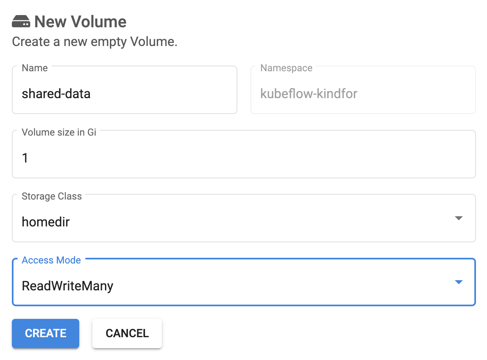
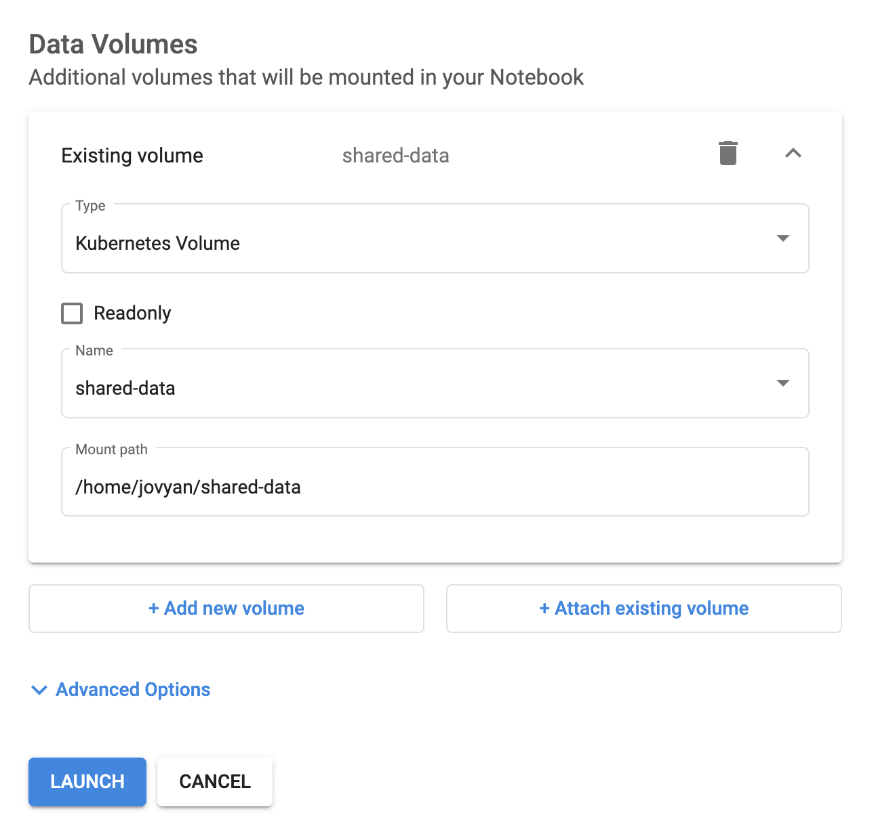
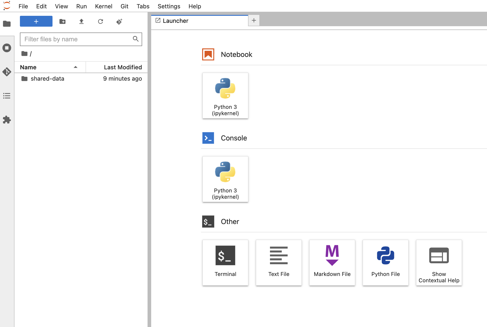
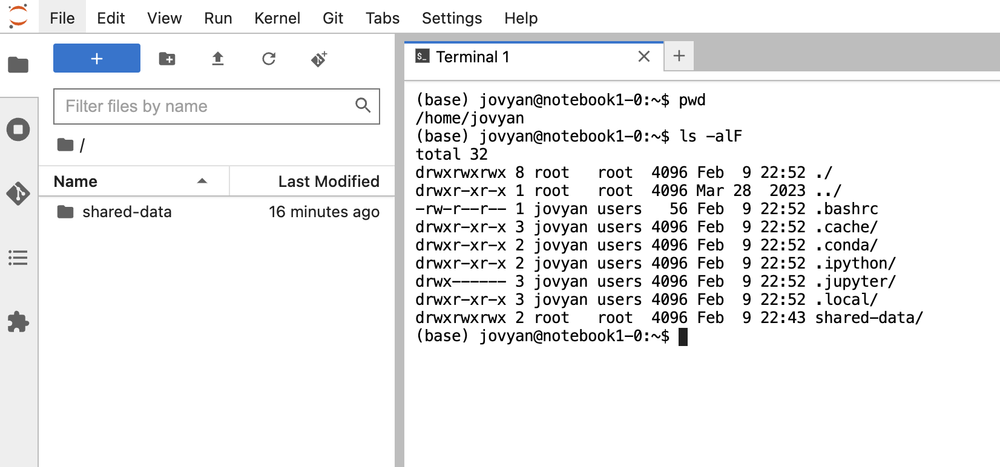
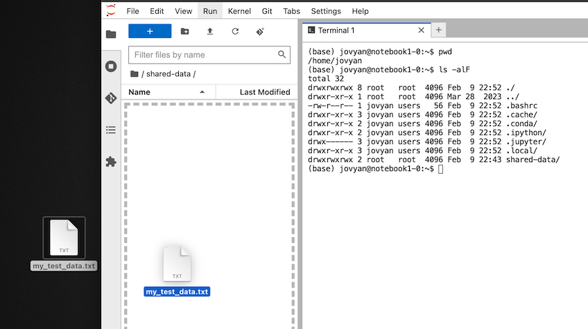
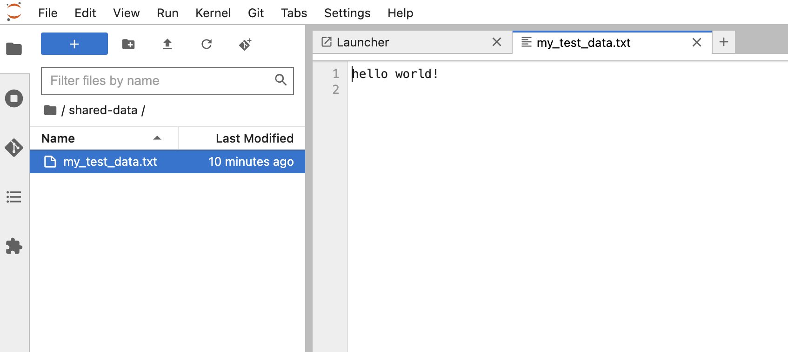

# Shared Data Volume in Workbenches

## 1. Create a shared volume

Navigate to "kubeflow UI dashboard" -> "Volumes" sidebar menu

1. Choose your namespace


2. Click on `+ New Volume` button to create a volume with the following input values.

|New Volume| Value|
|:--- | :--- |
|Name: | shared-data|
|Volume size in Gi: | 1 |
|Storage Class: | homedir |
|Access Mode: | ReadWriteMany |

3. Click on `Create` button to create the shared volume



**Important:**
* The `Access Mode` must be `ReadWriteMany`, since you will attach the same volume into different pods/workbenches
* For a workspace created for a workbench, you have choose `ReadWriteOnce` since the workspace volume is only attached to one workbench at a time.

**Storage Classes:**

In the current Kubeflow manifests deployment, you can create volume on 2 storage class
* `homedir`: netapp NFS storage class, will be backuped every 24 hours.
* `longhorn`: worker nodes local storage class, will NOT be backuped 

The "basic-csi" storage class is deprecated, you can still access the volume if you have created one on this storage class in the past, you will not be able to create new volume in this storage class.

If you have volatile data in large qantity, use the `longhorn` storage class.

If you have median sized data, which need backup, use the `homedir` storage

Don't use `basic-csi` storage class any more.

## 2. Attach shared data volume to multiple notebooks

### 2.1 Attach shared data volume to notebook1
Let's attach this shared volume to a notebook.

1. Navigate to "Kubeflow UI Dashboard" -> "Notebooks" -> "+ New Notebook"

2. Input the following values in the `New notebook` plane

| Basic Category | Input |
|:--- | :--- |
| Name: | notebook1 |
| Type: | JupyterLab |
| Custom Notebook: | kubeflownotebookswg/jupyter-scipy:v1.7.0 |
| CPU: | 0,2 |
| RAM in GiB: | 0,5 |

| Workspace Volumes | Input |
|:--- | :--- |
| New volume | |
| Type | Empty volume |
| Size in Gi | 5 |
| Storage class | homedir |
| Access mode | ReadWriteOnce |
| Mount path | /home/jovyan |

| Data Volumes | Input |
|:--- | :--- |
| + Attach existing volume | |
| Type: | Kubernetes Volume |
| Readony: | <left uncheck, since we want to write to the volume> |
| Name | shared-data |
| Mount path | /home/jovyan/shared-data |



3. Click on `LAUNCH` button to create a new jupyterlab workbench.

### 2.2 View shared data volume in notebook1

After `CONNECT` to the `notebook1` workbench

You can see the shared data volume name `shared-data` is show in the jupyterlab file brower.



Lets view it in a terminal by typing:
```shell
pwd
ls -alF
```


You can see, the `share-data` volume is mounted in `/home/jovyan/shared-data`.

**Important**
* Allways mount your shared data volume at the path `/home/jovyan`, not at any system partition path.

### 2.3 Put data into notebook1 shared data volume

1. Navigate into the `shared-data` folder by double click on the it in the juypterlab brower 
2. Drag a file into the left data plane to upload it into the shared volume `shared-data`




### 2.4 Attach shared data volume to notebook2
Let's attach the prevous shared volume to another notebook.

1. Navigate to "Kubeflow UI Dashboard" -> "Notebooks" -> "+ New Notebook"

2. Input the following values in the `New notebook` plane

| Basic Category | Input |
|:--- | :--- |
| Name: | notebook2 |
| Type: | JupyterLab |
| Custom Notebook: | kubeflownotebookswg/jupyter-scipy:v1.7.0 |
| CPU: | 0,2 |
| RAM in GiB: | 0,5 |

| Workspace Volumes | Input |
|:--- | :--- |
| New volume | |
| Type | Empty volume |
| Size in Gi | 5 |
| Storage class | homedir |
| Access mode | ReadWriteOnce |
| Mount path | /home/jovyan |

| Data Volumes | Input |
|:--- | :--- |
| + Attach existing volume | |
| Type: | Kubernetes Volume |
| Readony: | <left uncheck, since we want to write to the volume> |
| Name | shared-data |
| Mount path | /home/jovyan/shared-data |


3. Click on `LAUNCH` button to create a new jupyterlab workbench.

### 2.4 View shared data volume in notebook2

Navigate to "Kubeflow UI Dashboard" -> "Notebooks" -> "CONNECT" notebook2

You can now see the content of the previous uploaded file inside the shared data volume `shared-data`
by click on the shared file by notebook1.




## 3. Clean up

**WARNING:**
* While deleting notebook and volume, please take your time and do it one after another.
* Since the list of item will shift after delete, if you delete multiple element at a time, you may miss delete the wrong element in the list.


Let's clean up thing, free the resource quota and do it one after another slowly.

1. stop `notebook1`, delete `notebook1`
2. stop `notebook2`, delete `notebook2`
3. delete the volume `notebook1-volume`
4. delete the volume `notebook2-volume`
5. delete the volume `shared-data`


