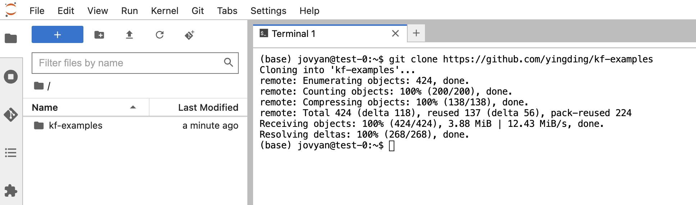
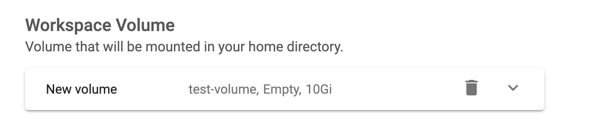
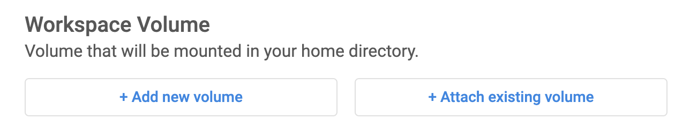
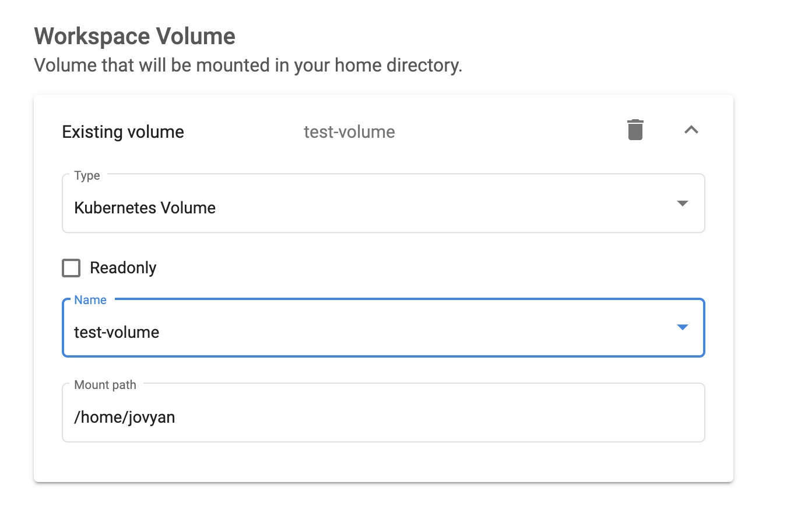
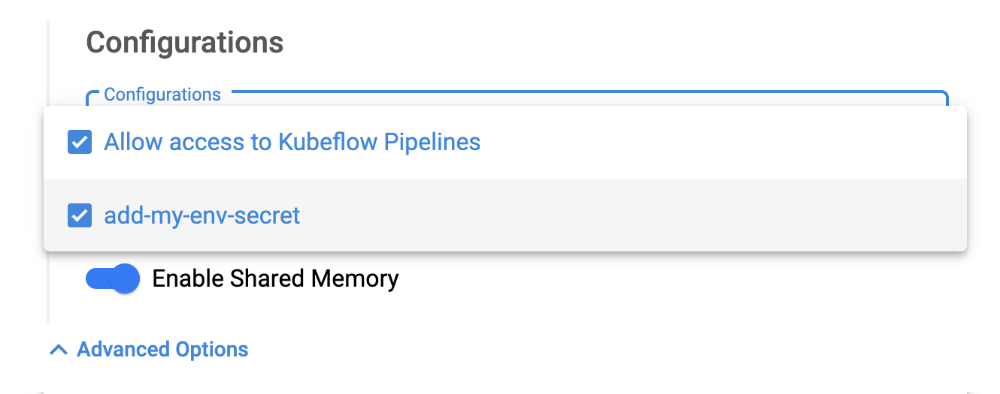

# Git Versioning and Env variable

## 1 Create a test notebook
Let's create a test notebook

1. Navigate to "Kubeflow UI Dashboard" -> "Notebooks" -> "+ New Notebook"

2. Input the following values in the `New notebook` plane

| Basic Category | Input |
|:--- | :--- |
| Name: | \<yourname\>-test |
| Type: | JupyterLab |
| Custom Notebook: | kubeflownotebookswg/jupyter-scipy:v1.7.0 |
| CPU: | 0,2 |
| RAM in GiB: | 0,5 |

| Workspace Volumes | Input |
|:--- | :--- |
| New volume | |
| Type | Empty volume |
| Size in Gi | 5 |
| Storage class | homedir |
| Access mode | ReadWriteOnce |
| Mount path | /home/jovyan |

3. Click on `LAUNCH` button to create a new jupyterlab workbench.

## 2 Download workshop git repository

1. Let's `CONNECT` to the `<yourname>-test` notebook
2. Open a terminal in juypterlab and type:
```shell
git clone https://github.com/yingding/kf-examples
```
3. Now you shall see the workshop tutorial and code repository appears in the jupyterlab brower



Note:
* It is highly recommended to put your code into a code version system such as Git, so that you can sync your code and share it with other teammates. 
* It is general not recommended to share a notebook with other teammates, but rather use Git to share and merge code. You can still use Jupyter Real-Time Collaboration https://github.com/jupyterlab/jupyter-collaboration to do so on your own responsibility to allow live time edit or jupyter notebooks by multiple users.

## 3 Apply PodDefault CRD into your namespace

PodDefault is a Kubeflow CRD (Custom Resource Definition) helps to inject env, vars, volumes into pod in kubernetes.

You will need PodDefault to mount access token to be able to connect with Kubeflow Pipeline from a Workbench.

You can also use PodDefault to define access keys as environment variables to access S3 storage, or SQL database.

The advantage of using PodDefault to mount environment variables is that you can define the secrets and access key once, and it can be used in different notebooks or kubeflow pipeline components. These secrets will be mounted as environment variables into the Pods during the pod creation.


Reference:
* PodDefault:  https://github.com/kubeflow/kubeflow/blob/master/components/admission-webhook/README.md

You are still connected with `\<yourname\>-test` Jupyter Workbench.
1. Open the terminal in JupyterLab, and execute:
```shell
MY_NAMESPACE=<your-namespace>;
echo ${MY_NAMESPACE}
```
change the `MY_NAMESPCE` bash variable to your real namespace, and double check the output.

If your namespace are set, run the following command in terminal to apply the PodDefault examples:
```shell
# create a S3 storage env variable in Jupyter Notebook
kubectl -n ${MY_NAMESPACE} apply -f $HOME/kf-examples/workshops/configs/my-env-poddefault.yaml

# create a access token mount in Jupyter Notebook
kubectl -n ${MY_NAMESPACE} apply -f $HOME/kf-examples/workshops/configs/ml-pipeline-poddefault.yaml
```

You shall see the console output
```shell
poddefault.kubeflow.org/my-env-secret created
```

If you see an error 
```shell
Error from server (Forbidden): error when applying patch: ...
```
DON'T panic, it means the PodDefault has already been created and exists in your namespace, you can proceed safely and ignore this error.

## 4 Re-create the test notebook and attach PodDefaults
Let's `stop` and `delete` the `test` notebook, but leave the workspace volume untouched.

Create the `<yourname>-test` notebook again, attach the existing workspace volume and PodDefaults:

1. Navigate to "Kubeflow UI Dashboard" -> "Notebooks" -> "+ New Notebook"

2. Input the following values in the `New notebook` plane

| Basic Category | Input |
|:--- | :--- |
| Name: | \<yourname\>-test |
| Type: | JupyterLab |
| Custom Notebook: | kubeflownotebookswg/jupyter-scipy:v1.7.0 |
| CPU: | 0,2 |
| RAM in GiB: | 0,5 |

3. "Delete" the "new volume"



4. Then you will see the option of "+ Attach exisiting volume", click on it.



and input the following values:

| Existing volume | Input |
|:--- | :--- |
| Type: | Kubernetes Volume |
| Readonly | <left uncheck, since we want to use the volume as workspace to write> |
| Name: | test-volume |
| Mount path: | /home/jovyan |



5. Open the Advanced Options


and select the two Configurations
* Allow access to Kubeflow Pipelines
* add-my-env-secret



Note:
* the select Configuraitons are the `spec.desc` in the two PodDefault file you have been applied to your namespace.
* Please revisit the PodDefault files in `KF-examples/workshops/configs` folder to see the content.

6. Click on `LAUNCH` button to create a new jupyterlab workbench.

## 5. View the mounted token partition and ENV variables in test notebook

Let's `CONNECT` to our recreated `<yourname>-test` notebook

1. You shall see that our tutorial git repository is in the recreated notebook, since you attached the workspace volume prevously, so you still have the data inside the prevous workspace volume.

2. Let's open a terminal and type:
```shell
env | grep "S3_ENDPOINT"
```
you will see that your `S3_ENDPOINT` env variable is availabe in this workbench (jupyterlab notebook).

If you want to use some env variable constantly in different workbench, you can create PodDefault in your namespace and select these PodDefaults in the "Advanced Options, Configuration" to mount env variable into workbenches.

3. Let's see the token mounted by the `Allow access to Kubeflow Pipelines` PodDefault in terminal:

```shell
cd /var/run/secrets/kubeflow/pipelines
ls -alF
```

4. You can remove the PodDefault `my-env-poddefault.yaml`

You shall still leave `Allow access to Kubeflow Pipelines` PodDefault untouched, since you will use this in later tutorial section for applying kubeflow pipeline.

You can remove the PodDefault from your namespace by type the following commands in the terminal:
```shell
MY_NAMESPACE=<your-namespace>;
# double check namespace is right
echo ${MY_NAMESPACE}

# remove the poddefault from namespace
kubectl -n ${MY_NAMESPACE} delete -f $HOME/kf-examples/workshops/configs/my-env-poddefault.yaml
```

**Important:**
* For now on, you shall not be able to select the removed PodDefault for other workbenches during the creation.
* You can still see the env variable mounted in the current workbench from terminal `env | grep "S3_ENDPOINT"`, even after teh removal of PodDefault, since the environment variable is created during the creation time of the Kubernetes pod, so you still have the env in your workbench pod.

## 5 (Optional) Clean up

If you want to further proceed with the next optional section, please go on.

Otherwise, you shall clean up the resources to gain `karma` points and don't waste cpu resources.

1. `stop` and `delete` the current `test` notebook
2. `delete` the workspace volume `test-volume` of the `test` notebook.

## 6 Summary

You have learned:
* Sharing Code using Git Version System inside Jupyter Workbenches
* Define and mount reusable environment variable for Jupyter Workbenches with PodDefault


