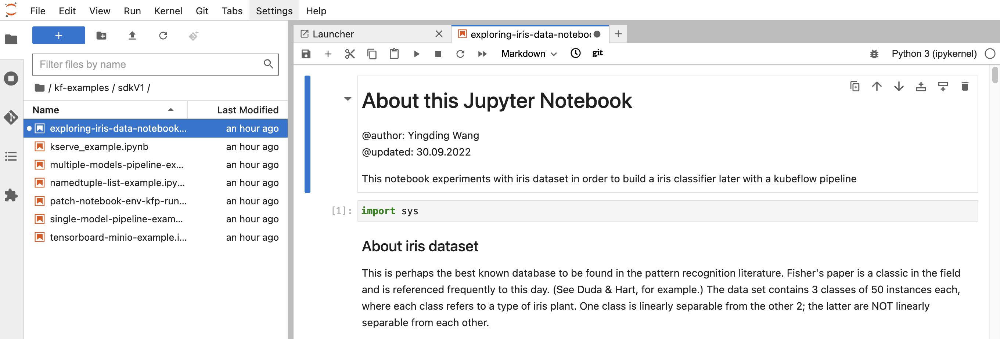

# Working with python juypter notebook

If you have kept the `test` juypterlab workbench from prevous tutorial, you can proceed.

If you have created a new juypterlab workbench, you can download the workshop git repository from the terminal with:
```shell
cd $HOME;
git clone https://github.com/yingding/kf-examples;
```

## Access the python notebook example

Navigate to `/home/jovyan/kf-examples/sdkV1` folder from the JupyterLab file browser.

Open the python notebook file `exploring-iris-data-notebook.ipynb` by double click on it

You shall see the python notebook file now open, you can now run the notebook cells, and explore the python notebook.



## Clean up

If you are done, remember to clean up the resource.
1. close the JupyterLab workbench tab in your browser
2. `stop` and `delete` your current JupyterLab workbench from the `Kubeflow UI Dashboard` notebooks menu
3. `delete` the workspace volume associated to the current JupyterLab workbench

